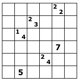

# Problem 3

Your friend Minos is asking for your help to build some nice labyrinth-like structures.

Actually, you have to build a polyomino in a square grid, that is, make some cells of a grid black so that all blacks are connected orthogonally.
To save concrete, 2x2 black areas must be avoided.
Moreover, some cells are marked with numeric clues (from 1 to 4 numbers), indicating the length of consecutive black blocks in the neighboring cells;
blocks can appear in any order and are separated by at least one white cell.


## Input format

The first line contains two integers, `S` and `N`, the size of the grid and the number of cells with clues.
Each of the following `N` lines contains two integers denoting a cell with clues, followed by an integer `C` representing the number of clues in the cell, and followed by `C` integers being the actual clues.


## Output format

`S` lines of `S` chars each, where `.` denotes a free cell, and `*` denotes a filled cell.


## Constraints

* `S` between 6 and 35
* at most 300 cells with clues


## Example

Instance:

```
6 6
1 5 2 2 2
2 3 2 2 3
3 2 2 1 4
4 5 1 7
5 4 2 2 4
6 2 1 5
```



Expected output:

```
.*.*.*
**.*.*
*..***
*.**.*
***.**
*.*.*.
```


SHA-1 of the expected output: `5d8f97a1cd6d2ce3e9fd4d22255d72008c385ae4`

Characters in the expected output: `42`


## Self-check your solution before submission

SHA-1 of the expected output:

```
$ sha1sum instance.*.out
ec50212a4a40141af48ae22478b445e1d70bb954  instance.0.out
8ac8970c2ca0cc911bc4345478500d30ca5f91f0  instance.1.out
64eb27dac3ff51c16f8542ba8b8a56a2e113f897  instance.2.out
168ff9b398b4e0c3299ecdf56f35c477bba221d8  instance.3.out
881de791e923f99c8bbcbea45f65ca54d6daf594  instance.4.out
f70e82463ddfe73d5d9110ccacd9b3eb827d59a6  instance.5.out
```

Characters in the expected output:

```
$ wc -c instance.*.out
  42 instance.0.out
 110 instance.1.out
 420 instance.2.out
 650 instance.3.out
 930 instance.4.out
1260 instance.5.out
```
