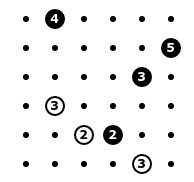
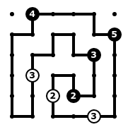

# Problem 5

*The problem is named Shingoki, and can be played [here](https://www.puzzle-shingoki.com/).*

Once again, your friend Enzo Ferrara is asking for your help to sketch a new speed circuit.

You are given a square grid with some cells containing white or black circles;
circles also contain numeric clues.
The grid is essentially the area hosting the circuit, and circles denote already built grandstands (of two types, straight and curved).
Numeric clues are associated with the price of a seat, with the rationale that the higher the price, the farther you should see.
That said, adjacent cells can be connected (representing a piece of the circuit), no crossing or branches are permitted, and one single loop must be constructed, traversing all white and black circles.
Additionally, white circles must be passed through in a straight line, and black circles must be turned upon.
Finally, the numeric clues are the sum of the lengths of the two straight lines going out of the associated circle.


## Input format

The first line contains three integers, `S`, `W` and `B`, the largest index in the grid (i.e., the size of the grid minus 1), and the number of white and black circles.
The following `W` lines contains three integers each, the coordinates of cells with white circles (0-indexed) and the associated numeric clues.
The following `B` lines contains two integers each, the coordinates of cells with black circles (0-indexed) and the associated numeric clues.


## Output format

A line containing one integer, `H`, representing the number of horizontal connections, followed by `H` lines containing two integers and representing the left cell of a horizontal connection;
connections must be provided in lexicographical order.
After that, a line containing one integer, `V`, representing the number of vertical connections, followed by `V` lines containing two integers and representing the top cell of a vertical connection;
connections must be provided in lexicographical order.


## Constraints

* `S` between 5 and 40
* `W` and `B` between 1 and 300


## Example

Instance:

```
5 3 4
3 1 3
4 2 2
5 4 3
0 1 4
1 5 5
2 4 3
4 3 2
```



Expected output:

```
14
0 1
0 2
0 3
1 0
1 2
1 4
2 1
2 3
3 2
4 3
5 0
5 2
5 3
5 4
20
0 1
0 4
1 0
1 2
1 3
1 5
2 0
2 1
2 4
2 5
3 0
3 1
3 2
3 3
3 4
3 5
4 0
4 1
4 2
4 5
```



SHA-1 of the expected output: `6c8b8e2b2e5d930012ac2feac08f923471f03525`

Characters in the expected output: `142`


## Self-check your solution before submission

SHA-1 of the expected output:

```
$ sha1sum instance.*.out
d35e9fcc1d81d2ecd001f67ecef582ce29cb701c  instance.0.out
bce0d6ea5daf6634bfd0b182319935e10288ee3d  instance.1.out
cd508abca28ecc2ac065c4970453b87bd178cc67  instance.2.out
b7458253595a9db1b1696a8b245d139d0c3195ec  instance.3.out
1e860870a105cf9f5a03590ff11ccf271a5b8f95  instance.4.out
51626df9989594bebd9c55746914ac4a7d8641fd  instance.5.out
```

Characters in the expected output:

```
$ wc -c instance.*.out
  134 instance.0.out
  436 instance.1.out
 2165 instance.2.out
 4575 instance.3.out
 6496 instance.4.out
 8411 instance.5.out
```
